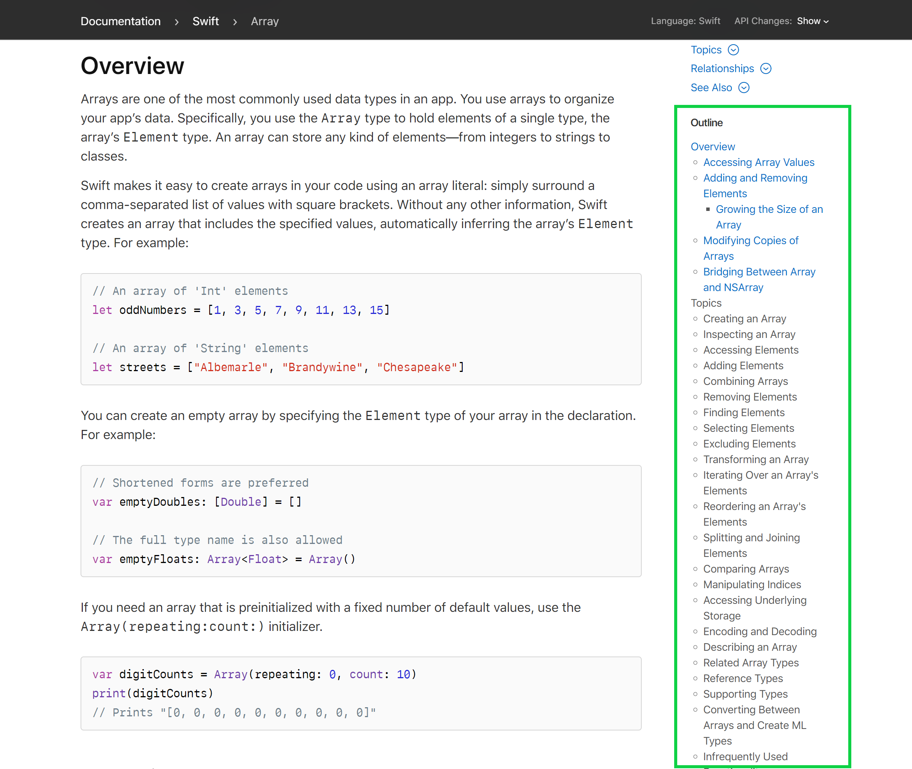
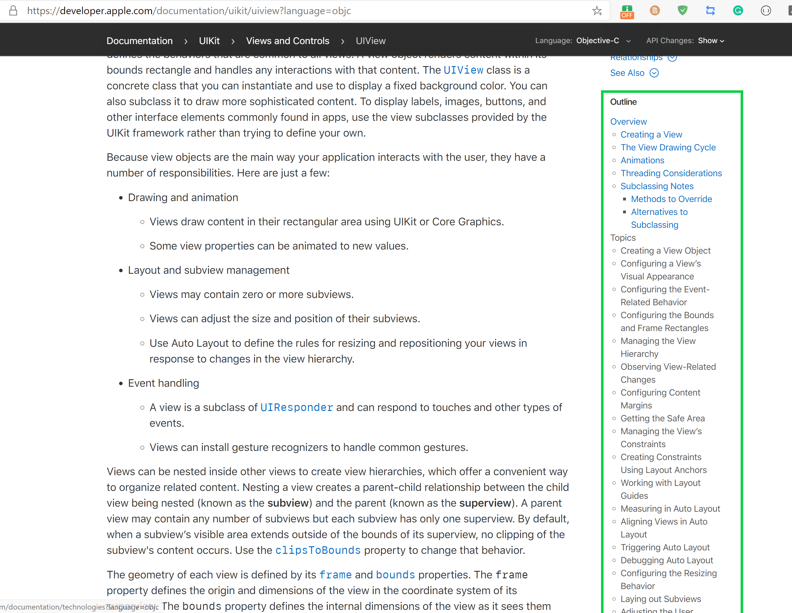
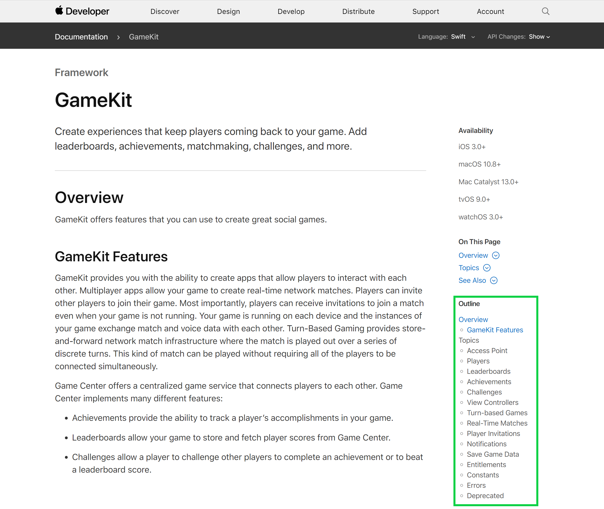

# Apple Documentation Outline Helper
Provide content outline for [Apple Developer Documentation](https://developer.apple.com/documentation/).

Apple developers read [Apple Developer Documentation](https://developer.apple.com/documentation/) frequently in their daily work. Although the documentation is well written, it doesn't provide a content outline that help developers get the structure of the articles. 

This extension improves the reading experience of [Apple Developer Documentation](https://developer.apple.com/documentation/) by adding an outline section on the right column of the page. 

# How To Use
For now this extension is not published on Chrome Web Store.(I tried but got a rejection) But you can use it under developer mode. 
1. Clone the project or download .zip release and decompress it. 
2. Open extension management page (chrome://extensions/) of your browser. 
3. Turn on "Developer mode"
4. Click "Load unpacked extension". 
5. Choose the folder of the project and click OK to install it. 
6. That's it! The extension takes effect whenever you navigate to a appropriate Apple Developer Documentation. 

# Screenshot
1. Swift documentation on `Struct Array`

2. `UiView` of Objective-C

3. GameKit Documentation

# LICENSE
MIT
