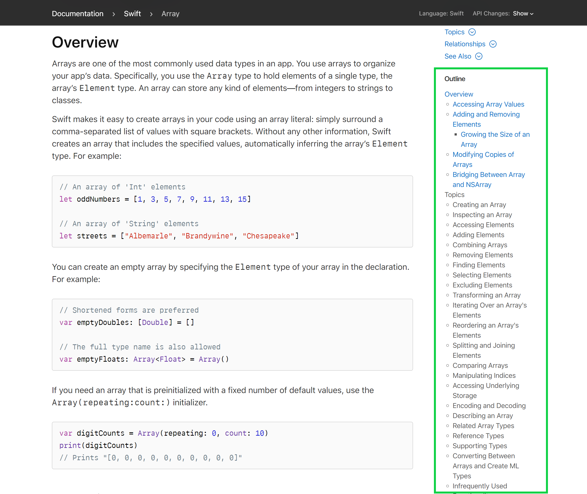
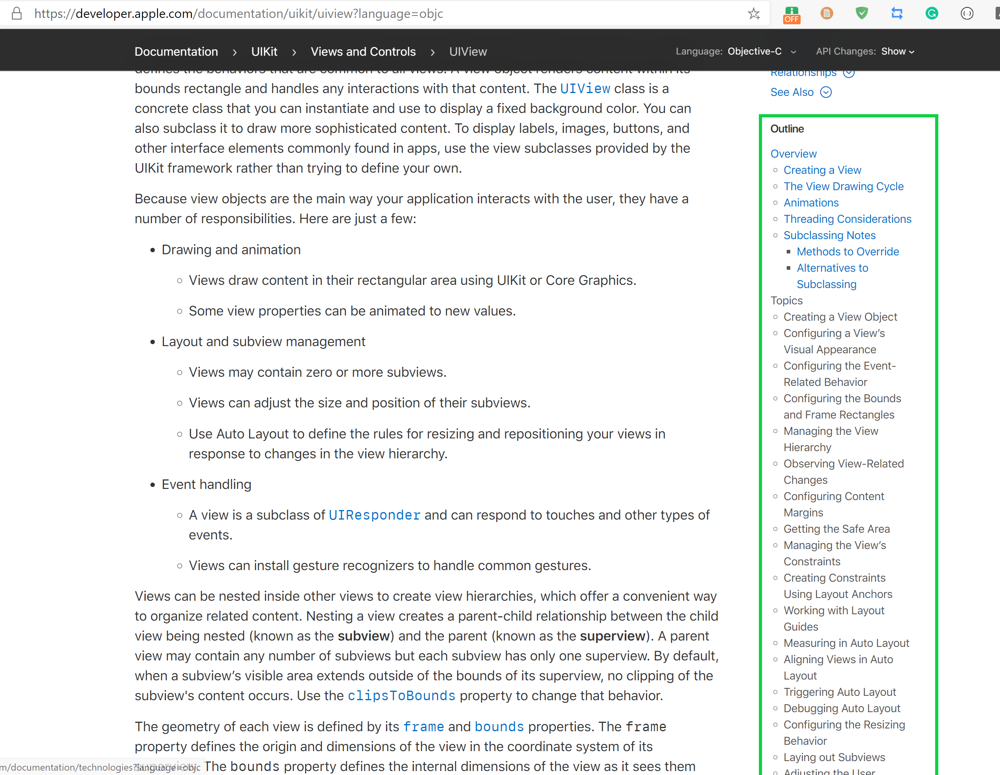
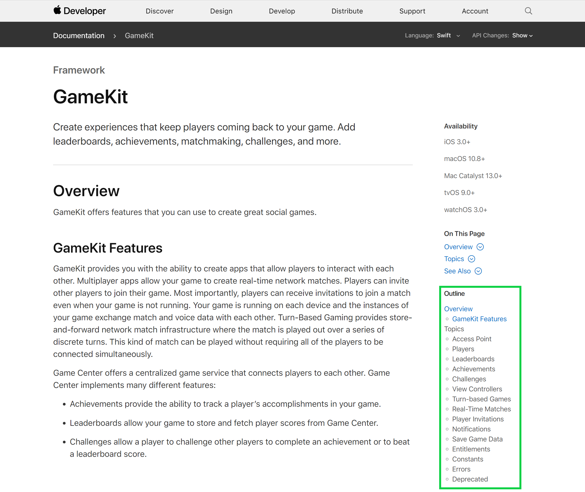

# Apple Documentation Outline Helper
Provide contents outline for [Apple Developer Documentation](https://developer.apple.com/documentation/).

# Screenshot
1. Swift documentation on `Struct Array`

2. `UiView` of Objective-C

3. GameKit Documentation

# LICENSE
MIT
